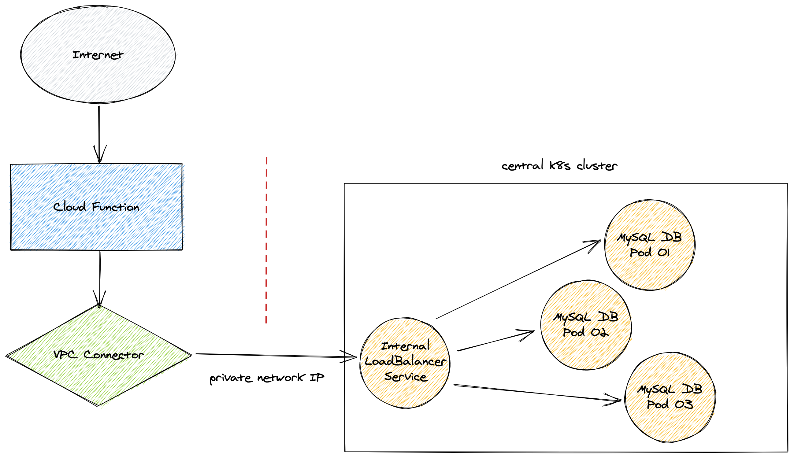
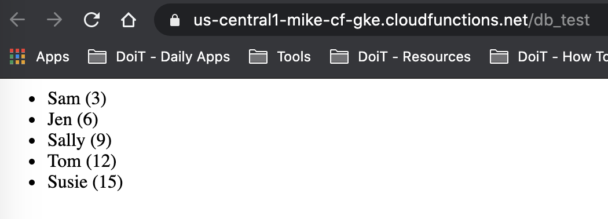

# Connecting Google Cloud Functions to Kubernetes Engine (GKE) Services
This demo illustrates how to connect Cloud Functions to other services (i.e. DB) running 
on Google Kubernetes Engine (GKE) clusters.

# Architecture
This demo illustrates the necessary elements, namely:

- GKE cluster with some service or DB running
- service or DB exposed with internal load balancer service
- serverless VPC connector
- Cloud Function configured to use the VPC connector




# Usage
1. Create or use an existing Google Cloud Platform project (demo purposes but any clusters should work)
2. Clone this repository to your computer, cd to `cloud-functions-gke-demo`
3. Create a `.env` file in the same directory as `create-k8s-clusters.sh`
```bash
cat > .env << EOF
export PROJECT_ID=<YOUR PROJECT ID>
export AUTH_NETWORK="<YOUR IP ADDRESS>/32"
EOF
```
4. Execute the bootstrap script `yes | ./create-k8s-clusters.sh` (optionally use `yes` to skip confirmation prompts)
5. After about 10-12 minutes, visit the test URL to your cloud function
- https://{GCP_REGION}-{PROJECT_ID}.cloudfunctions.net/db_test


6. Congratulations! You stood up a Percona MySQL DB cluster and connected a Cloud Function to it.

# Cleanup
To avoid unneccesary costs, be sure to either delete your project or delete the resources 
you created for this demo by using the `cleanup.sh` script:

```bash
yes | ./cleanup.sh   # (optionally use `yes` to skip confirmation prompts)
```

# References
- https://www.percona.com/doc/kubernetes-operator-for-pxc/gke.html
- https://dev.mysql.com/doc/connector-python/en/connector-python-examples.html

